# dbt-tap-spotify
This dbt package contains models for Matatika's [tap-spotify](https://github.com/Matatika/tap-spotify).

The main focus of the package is to transform stream `tap-spotify` data into usable analytics models.

This package along with the [Analyze Bundle](https://github.com/Matatika/analyze-spotify) are designed intended to work together to provide instant insights on the [Matatika Platform](https://www.matatika.com).

| **model**              | **description** |
| ---------------------- | ------------------------------------------------------------- |
| [global_top_tracks_daily](models/base/global_top_tracks_daily.sql) | Global top tracks for the day |
| [global_top_tracks_weekly](models/base/global_top_tracks_weekly.sql) | Global top tracks for the week |
| [global_viral_tracks_daily](models/base/global_viral_tracks_daily.sql) | Global viral tracks for the day |
| [user_top_artists_long_term](models/base/user_top_artists_long_term.sql) | User's top played artists, long term |
| [user_top_artists_medium_term](models/base/user_top_artists_medium_term.sql) | User's top played artists, medium term |
| [user_top_artists_short_term](models/base/user_top_artists_short_term.sql) | User's top played artists, short term |
| [user_top_tracks_long_term](models/base/user_top_tracks_long_term.sql) | User's top played tracks, long term |
| [user_top_tracks_medium_term](models/base/user_top_tracks_medium_term.sql) | User's top played tracks, medium term |
| [user_top_tracks_short_term](models/base/user_top_tracks_short_term.sql) | User's top played tracks, short term |
| [vw_top_listened_to_genre_long_term](models/base/vw_top_listened_to_genre_long_term.sql) | View of counts of genres listened to, long term |

```mermaid
erDiagram
    "source.tap_spotify.spotify_source.user_top_tracks_lt_stream" }|--|{ "model.tap_spotify.user_top_tracks_long_term" : ""
    "source.tap_spotify.spotify_source.user_top_tracks_lt_stream" }|--|{ "model.tap_spotify.user_top_tracks_long_term" : ""
    "source.tap_spotify.spotify_source.global_viral_tracks_daily_stream" }|--|{ "model.tap_spotify.global_viral_tracks_daily" : ""
    "source.tap_spotify.spotify_source.global_viral_tracks_daily_stream" }|--|{ "model.tap_spotify.global_viral_tracks_daily" : ""
    "source.tap_spotify.spotify_source.user_top_tracks_mt_stream" }|--|{ "model.tap_spotify.user_top_tracks_medium_term" : ""
    "source.tap_spotify.spotify_source.user_top_tracks_mt_stream" }|--|{ "model.tap_spotify.user_top_tracks_medium_term" : ""
    "source.tap_spotify.spotify_source.global_top_tracks_daily_stream" }|--|{ "model.tap_spotify.global_top_tracks_daily" : ""
    "source.tap_spotify.spotify_source.global_top_tracks_daily_stream" }|--|{ "model.tap_spotify.global_top_tracks_daily" : ""
    "model.tap_spotify.user_top_artists_long_term" }|--|{ "model.tap_spotify.vw_top_listened_to_genre_long_term" : ""
    "source.tap_spotify.spotify_source.user_top_artists_st_stream" }|--|{ "model.tap_spotify.user_top_artists_short_term" : ""
    "source.tap_spotify.spotify_source.global_top_tracks_weekly_stream" }|--|{ "model.tap_spotify.global_top_tracks_weekly" : ""
    "source.tap_spotify.spotify_source.global_top_tracks_weekly_stream" }|--|{ "model.tap_spotify.global_top_tracks_weekly" : ""
    "source.tap_spotify.spotify_source.user_top_tracks_st_stream" }|--|{ "model.tap_spotify.user_top_tracks_short_term" : ""
    "source.tap_spotify.spotify_source.user_top_tracks_st_stream" }|--|{ "model.tap_spotify.user_top_tracks_short_term" : ""
    "source.tap_spotify.spotify_source.user_top_artists_lt_stream" }|--|{ "model.tap_spotify.user_top_artists_long_term" : ""
    "source.tap_spotify.spotify_source.user_top_artists_mt_stream" }|--|{ "model.tap_spotify.user_top_artists_medium_term" : ""
```




## Installation Instructions
Check [dbt Hub](https://hub.getdbt.com/) for the latest installation instructions, or [read the dbt docs](https://docs.getdbt.com/docs/package-management) for more information on installing packages.

Include in your `packages.yml`
```yaml
packages:
  - git: https://github.com/Matatika/dbt-tap-spotify.git
```

### One time setup (after creating a python virtual environment)

    ```
    pip install dbt
    dbt deps
    ```

### development

    ```
    dbt test
    ```

## Database Support
This package has been tested on Postgres and Snowflake.

## Cloud hosting and SaaS
Deploy on the Matatika Platform within minutes. [www.matatika.com](https://www.matatika.com)

## Contributions

Additional contributions to this package are very welcome! Please create issues
or open PRs against `master`. Check out 
[this post](https://discourse.getdbt.com/t/contributing-to-a-dbt-package/657) 
on the best workflow for contributing to a package.

## Resources:
- Have questions, feedback, or need help? Please email us at support@matatika.com
- Find all of Matatika's pre-built dbt packages in our [dbt hub](https://hub.getdbt.com/Matatika/)
- Learn how to orchestrate [dbt transformations with Matatika](https://www.matatika.com/docs/getting-started/)
- Learn more about Matatika [in our docs](https://www.matatika.com/docs/introduction)
- Learn more about dbt [in the dbt docs](https://docs.getdbt.com/docs/introduction)

---

Copyright &copy; 2022 Matatika
